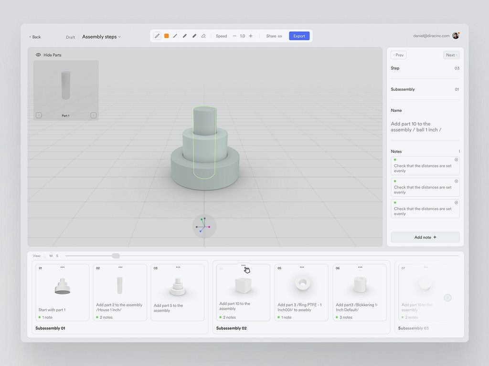

# Kuve 3D MVP — Next.js + React Three Fiber

Editor 3D web minimalista para **modelado hard-surface** construido con **Next.js**, **React Three Fiber** y **drei**.  
Incluye **TrackballControls** (rotación libre), **grilla infinita con fade**, **fondo claro + niebla**, y una **pieza ejemplo** en gris mate.

## Demo en producción
- **Sitio live:** https://kuve.studio



---

## Características

- **React Three Fiber** sobre **Three.js**
- **TrackballControls** (rotación/zoom/pan fluidos)
- **Grilla infinita** con desvanecido al horizonte
- **Fondo claro + niebla** para sensación de profundidad
- **Pieza demo** (cilindros apilados) en gris mate
- Base lista para crecer a editor (primitivas, selección, transformaciones, exportación)

---

## Stack

- **Next.js** (App Router, TypeScript, Tailwind)
- **three**
- **@react-three/fiber**
- **@react-three/drei**

---

## Inicio rápido

Requisitos: **Node 18+** y **npm**

```bash
git clone https://github.com/tu-usuario/kuve-3d-mvp.git
cd kuve-3d-mvp
npm install
npm run dev
# Abre http://localhost:3000


⠀⠀⠀⠀⠀⠀⠀⠀⠀⠀⠀⠀⠀⠀⣾⣿⣿⣿⣿⣷⢸⣿⣿⡜⢯⣷⡌⡻⣿⣿⣿⣆⢈⠻⠿⢿⣿⣿⣿⣿⣿⣿⣷⣦⣤⣀⠀⠀⠀⠀⠀⠀⠀⠀⠀⠀⠀⠀⠀⠀⠀⠀⠀⠀
⠀⠀⠀⠀⠀⠀⠀⠀⠀⠀⠀⠀⡁⢳⣿⣿⣿⣿⣿⣿⡜⣿⣿⣧⢀⢻⣷⠰⠈⢿⣿⣿⣧⢣⠉⠑⠪⢙⠿⠿⠿⠿⠿⠿⠿⠋⠁⠀⠀⠀⠀⠀⠀⠀⠀⠀⠀⠀⠀⠀⠀⠀⠀⠀
⠀⠀⠀⠀⠀⠀⠀⠀⠀⠀⢀⣱⡇⡞⣿⣿⣿⣿⣿⣿⡇⣿⣿⡏⡄⣧⠹⡇⠧⠈⢻⣿⣿⡇⢧⢢⠀⠀⠑⠀⠀⠀⠀⠀⠀⠀⠀⠀⠀⠀⠀⠀⠀⠀⠀⠀⠀⠀⠀⠀⠀⠀⠀⠀⠀
⠀⠀⠀⠀⠀⠀⠀⠀⠀⠀⢸⣿⣇⢃⢿⣿⣿⣿⣿⣿⣷⣿⣿⠇⢃⣡⣤⡹⠐⣿⣀⢻⣿⣿⢸⡎⠳⡄⠀⠀⠀⠀⠀⠀⠀⠀⠀⠀⠀⠀
⠀⠀⠀⠀⠀⠀⠀⠀⠀⠈⣾⣿⣿⠘⡸⣿⣿⣿⣿⣿⣿⣿⡿⣰⣿⣿⢟⡷⠈⠋⠃⠎⢿⣿⡏⣿⠀⠘⢆⠀⠀⠀⠀⠀
⠀⠀⠀⠀⠀⠀⠀⠀⠀⡐⢹⣿⣿⡐⢡⢹⣿⣿⣿⣿⡏⣿⢣⣿⣿⡑⠁⠔⠀⠉⠉⠢⡘⣿⡇⣿⡇⠀⡀⠡⡀⠀⠀⠀⠀⠀⠀⠀⠀
⠀⠀⠀⠀⠀⠀⠀⠀⠀⡇⠘⣿⣿⣇⠇⢣⢻⣿⣿⣿⡇⢇⣾⣿⣿⡆⢸⣤⡀⠚⢂⠀⢡⢿⡇⣿⡇⠀⢿⠀⠀⠄⠀⠀⠀
⠀⠀⠀⠀⠀⠀⠀⠀⠀⣿⠠⠹⣿⣿⡘⣆⢣⠻⣿⣿⢈⣾⣿⣿⣿⣶⣸⣏⢀⣬⣋⡼⣠⢸⢹⣿⡇⢠⣼⠙⡄⠀⠀⠀⠀⠀
⠀⠀⠀⠀⠀⠀⠀⠀⠀⢹⡇⠁⠹⣿⣇⠹⡃⠃⠙⡇⠘⢿⣿⣿⣿⣿⣿⣏⣓⣉⣭⣴⣿⠘⢸⣿⠁⠘⠋⠀⠹⠄⠀⠀⠀⠀⠀⠀⠀⠀⠀⠀⠀⠀⠀⠀
⠀⠀⠀⠀⠀⠀⠀⠀⠀⠈⢷⠀⠀⠈⢿⣇⠂⣷⠄⠐⠀⠘⣿⣿⣿⣿⣿⣿⣿⣿⣿⣿⣿⢠⢸⡏⠀⢀⣠⣴⣾⣿⣶⣄⠀⠀⠀⠀⠀⠀⠀⠀⠀⠀⠀⠀⠀
⠀⠀⠀⠀⠀⠀⠀⠀⠀⠀⠈⢆⠀⠀⠀⠙⠆⠈⠢⠲⠥⣰⣿⣿⣿⣿⣿⣿⣿⣿⣿⣿⣷⡞⣸⠁⠀⢸⣿⣿⣿⣿⣿⣿⡆⠀⠀⠀⠀
⠀⠀⠀⠀⠀⠀⠀⠀⠀⠀⠀⠀⠀⠀⠀⠀⠀⠀⠀⢶⣿⣿⣿⣿⣿⣿⣿⣿⣿⣿⣿⣿⠟⠄⠃⠀⠀⠘⣿⣿⣿⣿⣿⣿⣿⠀⠀⠀⠀
⠀⠀⠀⠀⠀⠀⠀⠀⠀⠀⠀⠀⠀⠀⠀⠀⠀⠀⠀⠀⠙⢿⣿⣿⣿⣿⡏⠹⣿⣿⡿⠫⠊⠀⠀⠀⣶⠀⢻⣿⣿⣿⣿⡿⡇⠀⠀⠀⠀⠀⠀⠀⠀⠀⠀⠀
⠀⠀⠀⠀⠀⠀⠀⠀⠀⠀⠀⠀⠀⠀⠀⠀⠀⠀⠀⠀⠀⠀⠈⠙⠛⠻⠿⠿⠿⢋⠀⠀⠀⠀⢀⣼⣿⡆⠈⣿⣿⣿⡟⣱⡷⠀⠀⠀⠀⠀⠀⠀⠀
⠀⠀⠀⠀⠀⠀⠀⠀⠀⠀⠀⠀⠀⠀⠀⠀⠀⠀⠀⠀⠀⠀⠀⠀⢁⣁⡀⠨⣛⠿⠶⠄⢀⣠⣾⣿⣿⣷⠀⢹⣿⡟⣴⠈⢃⣶⠔⠀⠀⠀⠀⠀⠀⠀⠀⠀⠀⠀⠀⠀⠀⠀⠀⠀
⠀⠀⠀⠀⠀⠀⠀⠀⠀⠀⠀⠀⠀⠀⠀⠀⠀⠀⠀⠀⠀⠀⠀⠀⣾⣿⣿⡄⢸⣿⣿⣿⣿⣿⣿⣿⣿⣿⡄⠈⣿⣿⡿⠀⡀⣿⣷⠀⠀⠀⠀⠀⠀⠀⠀⠀⠀⠀⠀⠀⠀⠀⠀⠀⠀
⠀⠀⠀⠀⠀⠀⠀⠀⠀⠀⠀⠀⠀⠀⠀⠀⠀⠀⠀⠀⠀⠀⠀⠀⢙⠻⣿⣿⢀⠙⠻⠿⣿⣿⣿⣿⣿⣿⡇⠁⣿⠟⡀⠈⣧⢰⣿⠆⠀⠀⠀⠀⠀⠀⠀⠀⠀⠀⠀⠀⠀⠀⠀⠀⠀
⠀⠀⠀⠀⠀⠀⠀⠀⠀⠀⠀⠀⠀⠀⠀⠀⠀⠀⠀⠀⠀⠀⠀⠀⠈⠿⠴⠮⣥⠻⢧⣤⣄⣀⡉⢩⣭⣍⣃⣀⣩⠎⢀⣼⠉⣼⡯⠀⠀⠀⠀⠀⠀⠀⠀⠀⠀⠀⠀⠀⠀⠀⠀⠀⠀
⠀⠀⠀⠀⠀⠀⠀⠀⠀⠀⠀⠀⠀⠀⠀⠀⠀⠀⠀⠀⠀⠀⠀⠀⠀⠑⠁⣛⠓⢒⣒⣢⡭⢁⡈⠿⠿⠟⠹⠛⠁⠀⠀⠀⠰⠃⠂⠀⠀⠀